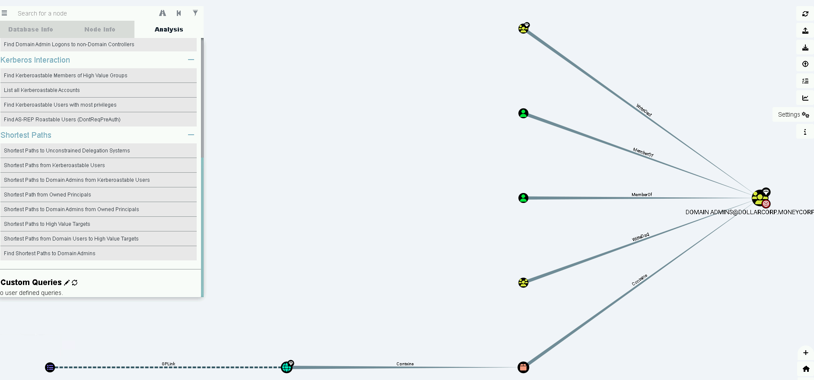

# CRTP: Hands-On 6

```
  • Setup BloodHound and identify shortest path to Domain Admins in the dollarcorp domain.
```
Index:

  1. [Bloodhound execution](#bloodhound-execution)
  2. [Dump data](#dump-data)
  3. [Shortest path to domain admin](#shortest-path-to-domain-admin)


## Bloodhound execution

COnfigure database with administrator rigths:
```
C:\Windows\system32>C:\AD\Tools\neo4j-community-4.4.5-windows\neo4j-community-4.4.5\bin\neo4j.bat install-service
Neo4j service installed.

C:\Windows\system32>C:\AD\Tools\neo4j-community-4.4.5-windows\neo4j-community-4.4.5\bin\neo4j.bat start
Directories in use:
home:         C:\AD\Tools\neo4j-community-4.4.5-windows\neo4j-community-4.4.5
config:       C:\AD\Tools\neo4j-community-4.4.5-windows\neo4j-community-4.4.5\conf
logs:         C:\AD\Tools\neo4j-community-4.4.5-windows\neo4j-community-4.4.5\logs
plugins:      C:\AD\Tools\neo4j-community-4.4.5-windows\neo4j-community-4.4.5\plugins
import:       C:\AD\Tools\neo4j-community-4.4.5-windows\neo4j-community-4.4.5\import
data:         C:\AD\Tools\neo4j-community-4.4.5-windows\neo4j-community-4.4.5\data
certificates: C:\AD\Tools\neo4j-community-4.4.5-windows\neo4j-community-4.4.5\certificates
licenses:     C:\AD\Tools\neo4j-community-4.4.5-windows\neo4j-community-4.4.5\licenses
run:          C:\AD\Tools\neo4j-community-4.4.5-windows\neo4j-community-4.4.5\run
Starting Neo4j.
Started neo4j. It is available at http://localhost:7474
There may be a short delay until the server is ready.
```
COnfigure new credentials
```
neo4j
BloodHound
```

Launch bloudhoun on the student machine:
```
C:\Users\student162>C:\AD\Tools\BloodHound-win32-x64\BloodHound-win32-x64\BloodHound.exe
```
Login with credentials

## Dump data

```
PS C:\AD\Tools\BloodHound-master\BloodHound-master> cd .\Collectors\
PS C:\AD\Tools\BloodHound-master\BloodHound-master\Collectors> Import-Module .\SharpHound.ps1
PS C:\AD\Tools\BloodHound-master\BloodHound-master\Collectors> Invoke-BloodHound -CollectionMethod All
2023-04-30T12:28:05.5401726-07:00|INFORMATION|This version of SharpHound is compatible with the 4.2 Release of BloodHound
2023-04-30T12:28:05.7121040-07:00|INFORMATION|Resolved Collection Methods: Group, LocalAdmin, GPOLocalGroup, Session, LoggedOn, Trusts, ACL, Container, RDP, ObjectProps, DCOM, SPNTargets, PSRemote
2023-04-30T12:28:05.7434422-07:00|INFORMATION|Initializing SharpHound at 12:28 PM on 4/30/2023
2023-04-30T12:28:09.9787159-07:00|INFORMATION|Flags: Group, LocalAdmin, GPOLocalGroup, Session, LoggedOn, Trusts, ACL, Container, RDP, ObjectProps, DCOM, SPNTargets, PSRemote
2023-04-30T12:28:14.3527065-07:00|INFORMATION|Beginning LDAP search for dollarcorp.moneycorp.local
2023-04-30T12:28:23.8750649-07:00|INFORMATION|Producer has finished, closing LDAP channel
2023-04-30T12:28:23.8842017-07:00|INFORMATION|LDAP channel closed, waiting for consumers
2023-04-30T12:28:44.8867372-07:00|INFORMATION|Status: 0 objects finished (+0 0)/s -- Using 80 MB RAM
2023-04-30T12:29:14.8934168-07:00|INFORMATION|Status: 187 objects finished (+187 3.116667)/s -- Using 95 MB RAM
2023-04-30T12:29:15.7747364-07:00|INFORMATION|Consumers finished, closing output channel
Closing writers
2023-04-30T12:29:16.9934965-07:00|INFORMATION|Output channel closed, waiting for output task to complete
2023-04-30T12:29:17.1028614-07:00|INFORMATION|Status: 209 objects finished (+22 3.370968)/s -- Using 95 MB RAM
2023-04-30T12:29:17.1028614-07:00|INFORMATION|Enumeration finished in 00:01:02.7687374
2023-04-30T12:29:17.2277194-07:00|INFORMATION|Saving cache with stats: 175 ID to type mappings.
 180 name to SID mappings.
 0 machine sid mappings.
 5 sid to domain mappings.
 0 global catalog mappings.
2023-04-30T12:29:17.2589665-07:00|INFORMATION|SharpHound Enumeration Completed at 12:29 PM on 4/30/2023! Happy Graphing!
```

## Shortest path to domain admin

Upload file, to Bloodhound application:
```
20230430122910_BloodHound.zip
```

